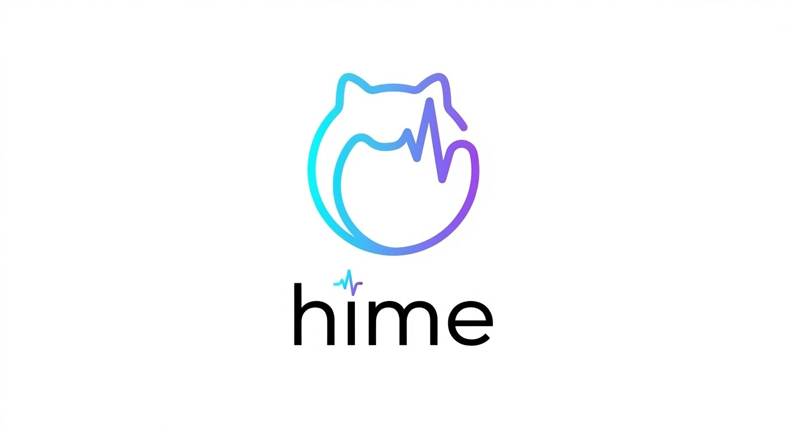

<p align="center">
  
</p>

<p align="center">
  <strong>HIME — Health Intelligence Management Engine</strong>
</p>

<p align="center">
  Self-hosted health data platform with an autonomous AI agent.
</p>

<p align="center">
  <a href="LICENSE"></a>
  <a href="https://github.com/thinkwee/Hime/actions/workflows/ci.yml"></a>
  <a href="docs/DEVELOPMENT.md"></a>
</p>

---

## Quick Start

This section is the fastest path from zero to a working HIME setup.

### 1) Start the server stack with Docker

```bash
git clone https://github.com/thinkwee/Hime.git
cd Hime
cp .env.example .env
```

Edit `.env` and set at least:

- `DEFAULT_LLM_PROVIDER` (for example `gemini`)
- corresponding API key (`GEMINI_API_KEY`, `OPENAI_API_KEY`, etc.)

Then start:

```bash
docker compose up --build
```

Expected endpoints:

- Frontend: `http://localhost:5173`
- Backend API: `http://localhost:8000`
- Watch exporter: `http://localhost:8765/ping`

### 2) Get the iOS app

**Option A** — App Store (if available): search for `HimeApp`.

**Option B** — Build from source: see [iOS / watchOS setup](docs/DEVELOPMENT.md#ios--watchos) for Xcode build instructions.

### 3) Fill required app/server settings

In HimeApp:

1. Open `Settings`.
2. Set `Server URL` to your server host (IP or domain) without path.
3. If your backend enables `API_AUTH_TOKEN`, set the same value in app `Auth Token`.
4. Grant HealthKit permissions when prompted.

Server-side must match:

- If local/LAN only, `API_AUTH_TOKEN` can stay empty.
- If public internet, set a strong `API_AUTH_TOKEN` and configure `CORS_ORIGINS`.
- Keep messaging gateways optional; you can enable them later.

After this, open the dashboard at `http://localhost:5173`, go to the **Agent Monitor** tab, and click **Start Agent**.

## Main Features

- Real-time wearable ingestion from Apple Watch + iPhone to local SQLite.
- Autonomous AI analysis with scheduled checks and event triggers.
- Chat interaction through Telegram / Feishu with evidence-backed responses.
- Personalised pages generated by the agent for repeated workflows.
- Skills system for reusable analysis playbooks.
- Strong self-hosted privacy posture; no telemetry pipeline in the project.

## Documentation

- End-user deployment details: [`docs/DEPLOYMENT.md`](docs/DEPLOYMENT.md)
- Developer onboarding and architecture: [`docs/DEVELOPMENT.md`](docs/DEVELOPMENT.md)
- Contribution process: [`CONTRIBUTING.md`](CONTRIBUTING.md)
- Security reporting: [`SECURITY.md`](SECURITY.md)
- Privacy policy: [`PRIVACY.md`](PRIVACY.md)

## Status

HIME is research-grade software for personal use. It is not a medical device and does not provide diagnoses.

## License

HIME is released under the [PolyForm Noncommercial License 1.0.0](LICENSE).

## Trademark

"HIME" and the HIME logo are trademarks of the Hime Organisation.
