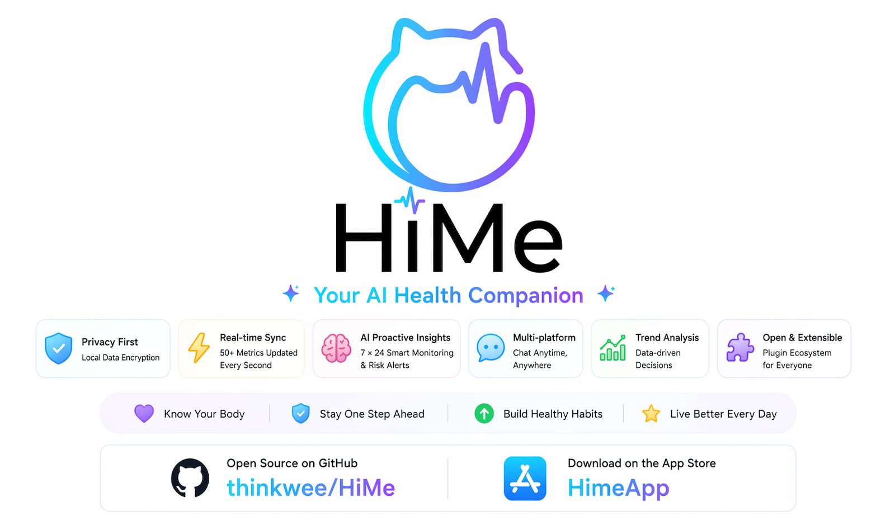
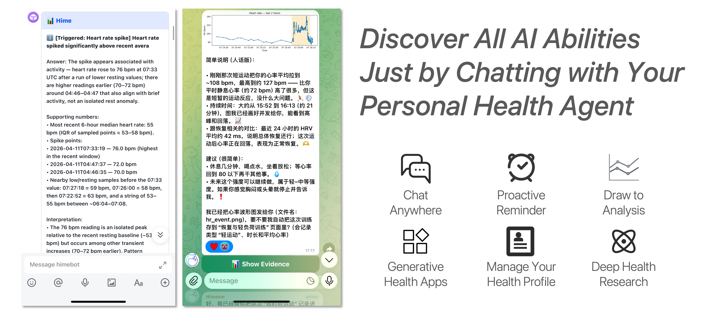
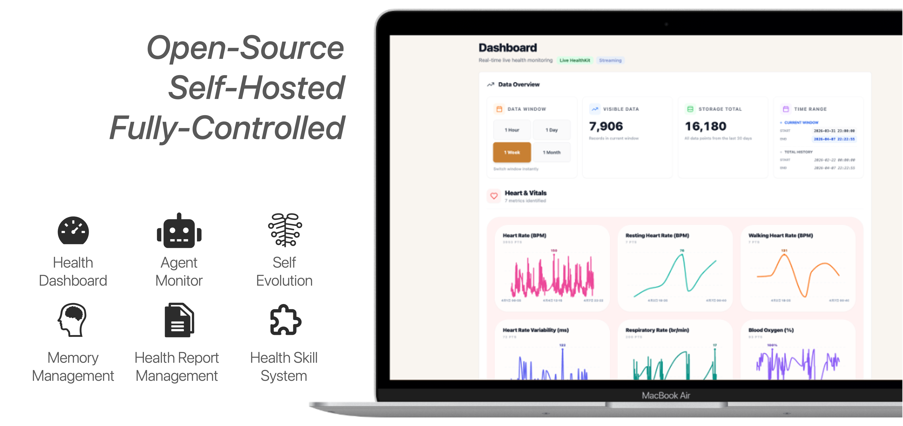
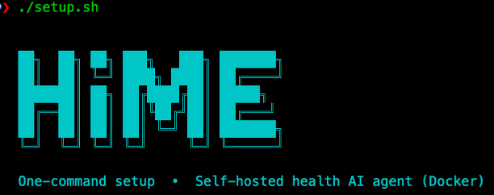

<p align="center">
  
</p>

<p align="center">
  <em>HiMe — Say Hi to Healthy Me</em>
</p>

<p align="center">
  One-Stop Personal Health AI Agent
</p>

<p align="center">
  <b>English</b> | <a href="README.zh.md">简体中文</a>
</p>

<p align="center">
  <a href="https://apps.apple.com/app/id6762160735"></a>
  <a href="docs/DEVELOPMENT.md"></a>
  <a href="docs/INSTALL.md#im-gateway-setup"></a>
  <a href="docs/INSTALL.md#im-gateway-setup"></a>
  <br/>
</p>

<p align="center">
  <a href="LICENSE"></a>
  <a href="https://github.com/thinkwee/HiMe/actions/workflows/ci.yml"></a>
  <a href="https://github.com/thinkwee/HiMe/releases/latest"></a>
  <a href="https://github.com/thinkwee/HiMe/commits/main"></a>
  
  
  
</p>

---

HiMe (Health Intelligence Management Engine) is a self-hosted, fully local, secure and open-source one-stop personal health AI agent platform. It understand your wearable health data in real-time and provide you with proactive insights 7/24, and of course, a cute pixel-art cat that serves as your personal health digital twin.

## Features

<p align="center">
  <a href="https://apps.apple.com/app/id6762160735"></a>
</p>

---

<p align="center">
  
</p>

---

<p align="center">
  
</p>

- Real-time wearable data ingestion from Apple Watch + iPhone, including heart rate, HRV, SpO2, sleep stages, workouts, mobility, and 50+ metrics more.
- iOS and watchOS companion apps for easy syncing health data and controlling the agent.
- Autonomous AI analysis with scheduled checks and event triggers.
- OpenClaw-style chat over Telegram or Feishu, with evidence-backed responses.
- Agent-generated personalised pages on demand for repeated workflows or personalised interaction. Generate your app, not learn to use it.
- Skills system for reusable analysis playbooks.
- Strong self-hosted privacy posture.

## Quick Start

Three steps. Total time: ~10 minutes.

### 1. Get IM credentials

HiMe chats with you over **Telegram** or **Feishu**. Pick one and grab the credentials before you start the server (the setup wizard will ask for them).

- **Telegram**: create a bot with [@BotFather](https://t.me/BotFather) → save the token. Send `/start` to [@userinfobot](https://t.me/userinfobot) → save your chat_id.
- **Feishu**: create a custom app at [open.feishu.cn](https://open.feishu.cn) → grab APP_ID + APP_SECRET. Invite the bot to a group → grab the open_chat_id.

Detailed walkthrough: [`docs/INSTALL.md#im-gateway-setup`](docs/INSTALL.md#im-gateway-setup).

### 2. Start the server

```bash
git clone https://github.com/thinkwee/HiMe.git HiMe
cd HiMe
./setup.sh
```

<p align="center">
  
</p>

Don't worry, just follow the quick start wizard in `setup.sh` and all the steps will be done for you. ~2-5 minutes for first build.

When it's done, the dashboard is at http://localhost:5173 — but you'll do most things through the iOS app.

### 3. Install the iOS app

- **Easy path**: install [HiMe on the App Store](https://apps.apple.com/app/id6762160735). Open Settings → Server URL → enter your host (e.g. `localhost`, your Mac's LAN IP, or `homelab.local`).
- **Build from source**: see [`docs/INSTALL.md#ios-app`](docs/INSTALL.md#ios-app).

That's it. Send the bot a message and the agent will reply.

## Update the HiMe

Pull the latest release and restart — your `.env`, `data/`, and `memory/` are preserved:

```bash
git pull
./hime.sh restart --rebuild   # Docker mode: rebuilds images
./hime.sh restart --clean     # Native mode: clears Python/node caches
```

If a new release adds variables, diff `.env.example` against your `.env` and fill in any missing keys. See [`docs/DEPLOYMENT.md`](docs/DEPLOYMENT.md#5-upgrades-and-backups) for backup guidance.

---

## Documentation

- [`docs/INSTALL.md`](docs/INSTALL.md) — manual setup, native dev install, public deployment, customization.
- [`docs/DEPLOYMENT.md`](docs/DEPLOYMENT.md) — LAN, public-internet, and Compose production patterns.
- [`docs/DEVELOPMENT.md`](docs/DEVELOPMENT.md) — architecture, adding tools/providers, code style.
- [`CONTRIBUTING.md`](CONTRIBUTING.md) — contribution process.
- [`SECURITY.md`](SECURITY.md) — security disclosure.
- [`PRIVACY.md`](PRIVACY.md) — privacy policy.

## Status

HiMe is research-grade software for personal use. It is not a medical device and does not provide diagnoses.

## License

HiMe is released under the [PolyForm Noncommercial License 1.0.0](LICENSE).

## Trademark

"HiMe" and the HiMe logo are trademarks of the HiMe Organisation.
